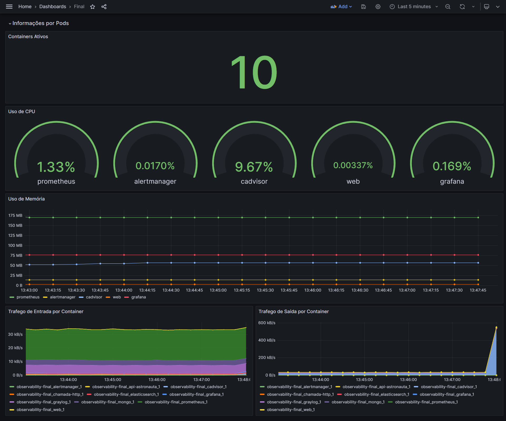
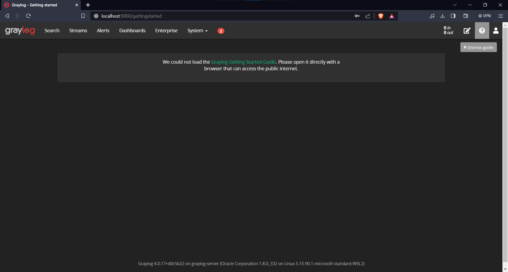

# Projeto Observability 

## Descrição do Projeto
Projeto desenvolvido para a disciplina de Observability do Programa Ser + Tech - Formação DevOps da Ada Tech + Núclea.

Alunos: [Matheus Santana](https://www.linkedin.com/in/matheusfsantana99/), [Anderson Dass](https://www.linkedin.com/in/andersondass/), [Kaline Marques](https://www.linkedin.com/in/kalinemarques/) e [Daniel Messias](https://www.linkedin.com/in/daniel-messias-filho/).

## Objetivo

Realizar a criação e configuração do ambiente de observability utilizando as ferramentas: Prometheus, Alertmanager, Grafana, Cadvisor e um Container com uma aplicação HTTP. Quanto ao Graylog, evidenciar o funcionamento local através da Tela inicial

## Execução:

## Pré-requisitos para executar o projeto
- Docker
- Docker Compose
- OBS: O projeto todo foi executado no WSL - Ubuntu, então se for executar numa máquina virtual(Virtual Box/VMware) ou em uma EC2 algumas configurações possam ser diferentes. Principalmente no arquivo docker-compose.yml pois utilizei localhost como endereço IP.
- OBS²: Ao longo da execução, talvez precise executar alguns comandos com permissão de SUDO.

## Instalação do Docker + Docker Compose

```
sudo apt update
sudo apt install
sudo apt install net-tools
curl -fsSL https://get.docker.com/ | sh
sudo curl -L https://github.com/docker/compose/releases/latest/download/docker-compose-$(uname -s)-$(uname -m) -o /usr/local/bin/docker-compose
sudo chmod +x /usr/local/bin/docker-compose
docker-compose –-version
```

## Após baixar o projeto ou dar um git clone, copie a pasta para dentro do WSL

## Dentro do WSL execute:

```
cp -r /mnt/c/Users/NOMEDOUSUARIO/Downloads/PASTADOPROJETO ~/
```

## Abra o diretório do projeto:

```
cd ~/PASTADOPROJETO
```

## Execute o script setup.sh
### Esse script automatiza a criação das aplicações python e executa o comando docker-compose up -d para criar e iniciar os containers
```
./setup.sh
```

Caso precise de permissão sudo

```
sudo ./setup.sh
```

## Se tudo tiver dado certo, agora você pode acessar os containers com localhost:PORTADOCONTAINER
## Para acessar o Grafana acesse seu navegador e digite: localhost:3000

Login: admin | Senha: admin

## Importando Dashboard

Vá para Dashboards
New -> Import -> Upload dashboard JSON file
Selecione o arquivo: dashboard.json ->  Import

## Dashboard



## Evidência Funcionamento do Graylog


